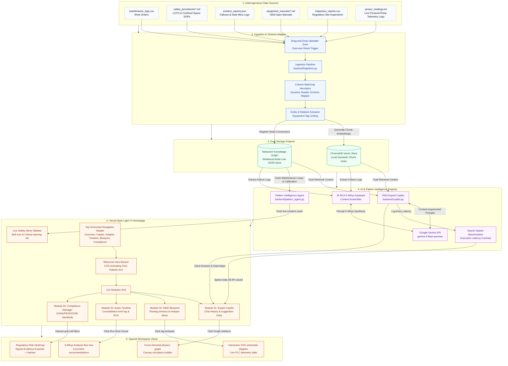

# PlantBrain Architecture Diagram Description

Below is the architectural layout of the **PlantBrain** Industrial Knowledge Intelligence Platform. This description maps out how data flows from disparate industrial sources to the interactive web dashboard.

---

---

## Technical Component Breakdown

### 1. Heterogeneous Data Sources
* **Structured Logs**: CSV files containing chronological operations, technicians, and compliance status.
* **Unstructured SOPs & OEM Manuals**: Text/Markdown files containing safety instructions, OEM guidelines, and engineering specs.
* **Incident Records**: JSON files containing near-miss details, severity, root causes, and corrective actions.
* **Sensor Streams**: Text files containing live pressure and temperature readings.

### 2. Ingestion & Dynamic Schema Mapper
* Reads any uploaded files dynamically using fallback CSV/JSON parsers.
* Performs column-matching to find equipment IDs, dates, and technicians across arbitrary table formats.
* Supports plain `.txt` and raw `.md` documents found directly inside the root import directory.

### 3. Dual Storage Model
* **Vector Database (ChromaDB)**: Chunks documents into logical segments, embeds them, and indexes them locally for high-speed semantic search.
* **Knowledge Graph (NetworkX)**: Links equipment IDs to their work orders, incidents, safety SOPs, manuals, and inspections. This structure ensures that relational queries can traverse paths immediately.

### 4. Engine Layer
* **Expert RAG Copilot**: Extracts equipment nodes in a user's question, fetches its linked graph nodes, merges them with semantic vector hits, and requests Gemini to generate a cited response.
* **Search Speed Benchmarker**: Calculates execution duration and displays a speed comparison indicator showing **99.9% Time Saved** vs manual folder lookups.
* **Pattern Intelligence Agent**: Scans maintenance frequency, failure intervals, and near-miss logs to find operational risks (e.g., a device failing repeatedly within a narrow day-interval).
* **AI Root Cause Analysis (RCA) Assistant**: Traces chronologies on the Knowledge Graph and fetches manuals from ChromaDB, feeding them to Gemini to synthesize a dynamic **5 Whys Analysis flowchart** on the fly.

### 5. Web Interface
* Served via **FastAPI** as a single-page app.
* Custom styled using a premium glassmorphic Slate-Light theme, featuring interactive onboarding, dynamic loading skeletons, active workspace transitions, and responsive chatbot controls.
* **Visual Additions**: Custom-drawn P&ID Blueprint with flashing sensor hotspots, live telemetry gauges, and interactive Regulatory Risk Heatmap matrices.
